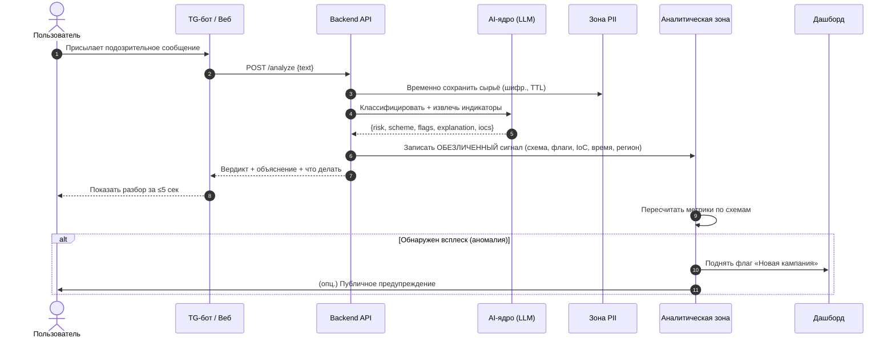
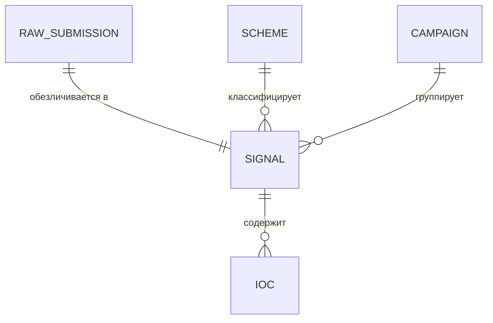

# ТЗ — Qorǵau: антифрод-платформа раннего предупреждения

## 0. Метаданные документа

| Поле | Значение |
|------|----------|
| Название | Qorǵau — платформа коллективной защиты от мошенничества |
| Версия | v0.1 (draft) |
| Дата | 2026-08-08 |
| Статус | Draft |
| Контекст | Хакатон «AI for Kazakhstan», горизонт сборки MVP — ~1 сутки |
| Назначение документа | Вход для AI-агента, генерирующего код + опора для питча |

**Как читать документ.** Он двухслойный:
- 🟢 **MVP (M)** — то, что реально собираем на хакатоне и показываем жюри.
- 🔵 **Vision (V)** — полная платформа «на 100%», продаётся со сцены как продукт/роадмап, но за сутки не строится.

Каждое требование помечено приоритетом MoSCoW: **M**ust / **S**hould / **C**ould / **W**on't (в этой итерации).

---

## 1. Цель, проблема, зачем

**1.1 Проблема.** 2025 — рекорд по онлайн- и телефонному мошенничеству в Казахстане, оценочный ущерб — до ~30 млрд тг/год. Люди (особенно пожилые и жители регионов) не умеют распознавать схемы, а общество узнаёт о новых волнах мошенничества постфактум, когда деньги уже потеряны.

**1.2 Цель.** Создать платформу, которая:
1. на входе — помогает конкретному человеку за секунды распознать развод (личная защита);
2. на выходе — из потока обращений строит **национальный радар мошенничества**: первой видит новые кампании и предупреждает всех остальных (коллективная защита).

**1.3 Ценность (профит — общественный, не денежный).**
- Предотвращённый ущерб (деньги, которые НЕ потеряны).
- Защита уязвимых групп через ранние публичные предупреждения.
- Обезличенная аналитика для банков/регулятора/полиции → точечная борьба с кампаниями.
- Рост цифровой грамотности общества.

**1.4 Метрики успеха.**

| ID | Метрика | Целевое значение (демо/пилот) |
|----|---------|-------------------------------|
| KPI-1 | Время анализа одного сообщения | ≤ 5 сек |
| KPI-2 | Точность классификации «скам / не скам» на тест-наборе | ≥ 85% |
| KPI-3 | Время от появления новой кампании до авто-предупреждения | ≤ 24 ч (цель — минуты) |
| KPI-4 | Доля обращений, обработанных без участия человека | ≥ 95% |

**1.5 Границы (Scope).**

*In scope (MVP):* TG-бот и веб-чекер для анализа текста; AI-ядро классификации; запись обезличенных сигналов в БД с разделением зон; дашборд с 3–4 графиками и детекцией аномалии; авто-предупреждение при всплеске.

*Out of scope (MVP, → Vision):* реальная телефония/звонилка, WhatsApp-канал, собственный VPN/DNS-фильтр, threat-intel API для банков, полноценный DWH, мобильные приложения, биллинг, продакшн-грейд безопасность и юридический комплаенс.

---

## 2. Термины и зависимости

**2.1 Глоссарий.**

| Термин | Определение |
|--------|-------------|
| Сигнал (signal) | Одно обращение: подозрительное сообщение, поданное на анализ |
| Схема (scheme) | Тип мошенничества (напр. «фейковая служба безопасности банка») |
| Индикатор (IoC) | Технический признак угрозы: домен, номер, IBAN, паттерн |
| Кампания (campaign) | Аномальный всплеск однотипных сигналов за короткое время |
| PII | Персональные данные (personally identifiable information) |
| Зона PII / Аналитическая зона | Логически и физически разделённые области хранения (см. §4) |

**2.2 Зависимости.**

| ID | Зависимость | Тип | Риск |
|----|-------------|-----|------|
| DP-1 | LLM API (провайдер на выбор команды) | внешний сервис | ключ/лимиты/латентность; нужен фолбэк |
| DP-2 | Хостинг для демо (локально + туннель, либо облако) | инфра | падение на сцене → нужен бэкап-режим |
| DP-3 | Telegram Bot API | внешний сервис | токен бота |

**2.3 Допущения и ограничения.**

| ID | Допущение / ограничение | Комментарий |
|----|-------------------------|-------------|
| AS-1 | Язык MVP — русский (скам в РК преимущественно на русском) | казахский — в Vision |
| AS-2 | Для демо детекции аномалий БД предзасевается синтетическими данными | живой поток мал во время демо |
| CN-1 | «Своя ML-модель» не обучается — используем готовый LLM API | разрешено правилами хакатона |
| CN-2 | Комплаенс GDPR/152-ФЗ реализуется на уровне архитектуры (разделение зон), а не полного юр. процесса | доказываем зрелость подхода |

---

## 3. Архитектура

### 3.1 Полная платформа (Vision) — модульная схема

```mermaid
flowchart LR
    subgraph CH[Каналы-сенсоры]
      TG[TG-бот]:::m
      WEB[Веб-чекер]:::m
      WA[WhatsApp-бот]:::v
      CALL[Звонилка / call-screening]:::v
      EXT[Расширение браузера + VPN/DNS]:::v
      BANKIN[Входящий API от банков]:::v
    end

    subgraph CORE[AI-ядро]
      CLS[Классификатор схем]:::m
      IOC[Извлечение индикаторов]:::m
      SCORE[Риск-скоринг + объяснение]:::m
      ANOM[Детектор аномалий/кампаний]:::m
    end

    subgraph DATA[Data-платформа]
      PIIZ[(Зона PII: шифр., короткий TTL)]:::m
      ANAZ[(Аналитическая зона: обезличенные паттерны)]:::m
      DWH[(DWH / витрины)]:::v
    end

    subgraph OUT[Выходы]
      DASH[Дашборд + отчётность]:::m
      ALERT[Сервис уведомлений]:::m
      FEED[Threat-intel фид для банков/операторов]:::v
      BLOCK[VPN/DNS блок-лист]:::v
    end

    CH --> CORE --> DATA --> OUT
    classDef m fill:#173,stroke:#0a5,color:#fff;
    classDef v fill:#334,stroke:#557,color:#bcd;
```



🟢 зелёные модули — MVP; 🔵 синие — Vision/роадмап.

### 3.2 Модули платформы (Vision) — что «нафаршировываем»

| Модуль | Что делает | Слой | Приоритет |
|--------|-----------|------|-----------|
| Каналы: TG-бот | приём и анализ текста в Telegram | сбор | M |
| Каналы: веб-чекер | то же в браузере, для демо | сбор | M |
| Каналы: WhatsApp | приём через WhatsApp Business API | сбор | C |
| Каналы: звонилка | облачный номер + переадресация, AI-скрининг звонков | сбор | W (Vision) |
| Каналы: расширение + VPN/DNS | блок фишинговых доменов у пользователя | сбор/защита | W (Vision) |
| AI-ядро: классификатор | тип схемы, риск, объяснение | обработка | M |
| AI-ядро: индикаторы (IoC) | домены/номера/IBAN из сообщения | обработка | M |
| AI-ядро: аномалии | всплеск однотипных сигналов = кампания | обработка | M |
| Data: зона PII | шифрованное краткое хранение сырья | хранение | M |
| Data: аналитическая зона | обезличенные паттерны/индикаторы | хранение | M |
| Data: DWH/витрины | исторические витрины, ETL | хранение | S |
| Дашборд/отчётность | графики, карта, тренды, кампании | выход | M |
| Сервис уведомлений | push/TG-канал/подписки родственников | выход | S |
| Threat-intel фид | API индикаторов для банков/операторов | выход | C |
| Админка/модерация | ревью, false-positive, дообучение промпта | сервис | S |

### 3.3 MVP — целевой поток (to-be)



**Бизнес-правила процесса.**

| ID | Правило | Тип |
|----|---------|-----|
| BR-1 | Сырой текст сообщения хранится только в зоне PII и удаляется по TTL (напр. 24 ч) | комплаенс |
| BR-2 | В аналитическую зону попадают только обезличенные признаки; прямые идентификаторы (ФИО, номера карт, телефоны-жертвы) маскируются на входе | комплаенс |
| BR-3 | Аномалия = рост числа сигналов по схеме за окно T выше порога (напр. z-score ≥ 3 или рост ≥ 300% к скользящему среднему) | расчёт |

---

## 4. Требования к БД

### 4.1 Разделение зон персональных данных (ключевая архитектурная фишка)



**Зона PII** (`pii` schema, шифрование, TTL):

| Сущность | Атрибут | Тип | Обязат. | Правила |
|----------|---------|-----|---------|---------|
| raw_submission | id | UUID | да | PK |
| raw_submission | raw_text | text (encrypted) | да | удаляется по TTL (BR-1) |
| raw_submission | channel | enum(tg, web) | да | — |
| raw_submission | created_at | timestamptz | да | — |
| raw_submission | expires_at | timestamptz | да | created_at + TTL |

**Аналитическая зона** (`analytics` schema, без PII):

| Сущность | Атрибут | Тип | Обязат. | Правила |
|----------|---------|-----|---------|---------|
| signal | id | UUID | да | PK; НЕ ссылается на raw после TTL |
| signal | scheme_code | enum | да | FK → scheme |
| signal | risk_score | int (0–100) | да | — |
| signal | flags | jsonb | да | список сработавших признаков |
| signal | impersonated_brand | text | нет | напр. «Kaspi», «Halyk» |
| signal | region | text | нет | если указан пользователем |
| signal | lang | enum(ru, kz) | да | — |
| signal | created_at | timestamptz | да | — |
| ioc | id | UUID | да | PK |
| ioc | signal_id | UUID | да | FK |
| ioc | type | enum(domain, phone, iban, url) | да | — |
| ioc | value_hash | text | да | хранить хэш/маску, не сырьё (BR-2) |
| scheme | code | text | да | PK, напр. `bank_security` |
| scheme | title_ru | text | да | «Фейковая служба безопасности банка» |
| campaign | id | UUID | да | PK |
| campaign | scheme_code | enum | да | FK |
| campaign | started_at | timestamptz | да | момент срабатывания аномалии |
| campaign | peak_value | int | да | пик числа сигналов |
| campaign | status | enum(active, closed) | да | — |

### 4.2 Требования (реестр).

| ID | Требование | Приоритет | Проверка |
|----|-----------|-----------|----------|
| REQ-DB-01 | Система ДОЛЖНА хранить сырой текст только в зоне PII в зашифрованном виде. | M | TC-DB-01 |
| REQ-DB-02 | Система ДОЛЖНА удалять записи зоны PII по достижении expires_at. | M | TC-DB-02 |
| REQ-DB-03 | Система НЕ ДОЛЖНА хранить в аналитической зоне прямые идентификаторы личности. | M | TC-DB-03 |
| REQ-DB-04 | Система ДОЛЖНА агрегировать сигналы по scheme_code и временным окнам. | M | TC-DB-04 |

---

## 5. Требования к AI-ядру и API

### 5.1 Обзор.

| Компонент | Направление | Формат | Назначение | Обработка ошибок |
|-----------|-------------|--------|-----------|------------------|
| LLM API | out | REST/JSON | классификация + объяснение | таймаут 8с, 1 ретрай, затем эвристический фолбэк |

### 5.2 Эндпоинт `POST /analyze`.

- **Назначение:** проанализировать сообщение, вернуть вердикт, записать обезличенный сигнал.
- **Запрос:**

```json
{ "text": "Здравствуйте, это служба безопасности банка...", "channel": "tg", "region": "Алматы" }
```

- **Успешный ответ (200):**

```json
{
  "risk_score": 92,
  "risk_level": "high",
  "scheme_code": "bank_security",
  "scheme_title": "Фейковая служба безопасности банка",
  "impersonated_brand": "Kaspi",
  "flags": ["запрос кода из СМС", "давление срочностью", "маскировка под банк"],
  "explanation": "Это похоже на мошенничество, потому что...",
  "recommended_actions": ["Не сообщайте код", "Положите трубку", "Позвоните в банк по номеру с карты"],
  "iocs": [{"type": "phone", "value_masked": "+7 7** *** ** 12"}]
}
```

- **Коды ошибок:**

| Код | Причина | Поведение клиента |
|-----|---------|-------------------|
| 400 | Пустой/слишком длинный текст | показать подсказку |
| 429 | Лимит LLM | показать «попробуйте ещё раз» |
| 200+degraded | LLM недоступен, сработал эвристический фолбэк | показать вердикт с пометкой «базовый режим» |

### 5.3 Прочие эндпоинты.

| Метод/путь | Назначение | Приоритет |
|------------|-----------|-----------|
| `GET /stats/summary` | сводка для дашборда (кол-во сигналов, топ схем) | M |
| `GET /stats/timeseries?scheme=` | ряд по схеме для графиков | M |
| `GET /campaigns/active` | активные кампании (аномалии) | M |
| `GET /threat-feed` | обезличенный фид индикаторов (для банков) | C (Vision) |

### 5.4 Требования (реестр).

| ID | Требование | Приоритет | Проверка |
|----|-----------|-----------|----------|
| REQ-AI-01 | Система ДОЛЖНА возвращать risk_score (0–100), scheme_code, flags и explanation на каждый непустой запрос. | M | TC-AI-01 |
| REQ-AI-02 | Система ДОЛЖНА укладываться в KPI-1 (≤5 сек) для сообщения ≤1000 символов. | M | TC-AI-02 |
| REQ-AI-03 | При недоступности LLM система ДОЛЖНА вернуть вердикт эвристическим фолбэком (правила по ключевым признакам). | M | TC-AI-03 |
| REQ-AI-04 | Система ДОЛЖНА маскировать извлечённые телефоны/карты/IBAN перед записью. | M | TC-AI-04 |
| REQ-AI-05 | Система ДОЛЖНА помечать всплеск по схеме как campaign при выполнении BR-3. | M | TC-AI-05 |

---

## 6. Требования к каналам и фронту

### 6.1 TG-бот (M).

| ID | Требование | Приоритет |
|----|-----------|-----------|
| REQ-BOT-01 | Бот ДОЛЖЕН принимать текст и возвращать вердикт с эмодзи-индикатором уровня риска. | M |
| REQ-BOT-02 | Бот ДОЛЖЕН показывать объяснение и список «что делать». | M |
| REQ-BOT-03 | Бот МОЖЕТ предлагать команду /trends со сводкой текущих кампаний. | S |

### 6.2 Веб-чекер + дашборд (M).

**Экраны:** (1) Чекер — поле ввода + результат; (2) Дашборд — метрики и графики.

| ID | Требование | Приоритет |
|----|-----------|-----------|
| REQ-FE-01 | Экран чекера ДОЛЖЕН показывать риск-метр (0–100), уровень, список флагов и «что делать». | M |
| REQ-FE-02 | Дашборд ДОЛЖЕН показывать: (а) счётчики сигналов, (б) график динамики по схемам, (в) топ схем/брендов, (г) баннер активной кампании. | M |
| REQ-FE-03 | При обнаружении кампании дашборд ДОЛЖЕН выделять её визуально (баннер «⚠ Новая волна»). | M |
| REQ-FE-04 | Все экраны ДОЛЖНЫ иметь состояния: загрузка, пусто, ошибка. | S |
| REQ-FE-05 | Дашборд МОЖЕТ показывать тепловую карту по регионам. | C |

---

## 7. Аналитика и детекция аномалий (ядро «сока»)

**Логика (простая, демоабельная):**
1. Считаем число сигналов по каждой схеме в скользящем окне (напр. по часам/дням).
2. Для схемы вычисляем скользящее среднее и стандартное отклонение.
3. Если текущее значение превышает порог (z-score ≥ 3 **или** рост ≥ 300% к среднему) → создаём `campaign`, поднимаем баннер, (опц.) шлём предупреждение.
4. Для демо БД предзасевается историей + «подкидывается» всплеск в реальном времени.

---

## 8. Критерии приёмки (Gherkin, MVP)

```gherkin
Дано пользователь отправил боту текст мошеннической СМС
Когда бот обрабатывает сообщение
Тогда за ≤5 секунд возвращается уровень риска, объяснение и список «что делать»
И в аналитическую зону записывается обезличенный сигнал

Дано LLM API недоступен
Когда пользователь отправляет сообщение
Тогда система возвращает вердикт эвристическим фолбэком с пометкой «базовый режим»

Дано в аналитике накопился резкий всплеск сигналов по одной схеме
Когда фоновый пересчёт обнаруживает превышение порога
Тогда создаётся кампания
И на дашборде появляется баннер «Новая волна»

Дано сообщение содержит номер телефона
Когда система извлекает индикаторы
Тогда номер сохраняется в маскированном/хэшированном виде
И сырой текст не попадает в аналитическую зону
```

---

## 9. Тест-кейсы (ключевые)

| ID | Связь | Предусловие | Шаги | Ожидаемый результат |
|----|-------|-------------|------|---------------------|
| TC-AI-01 | REQ-AI-01 | сервис поднят | отправить скам-текст | вернулись risk_score, scheme, flags, explanation |
| TC-AI-03 | REQ-AI-03 | LLM отключён | отправить скам-текст | вердикт из фолбэка, пометка degraded |
| TC-DB-03 | REQ-DB-03 | — | отправить текст с телефоном | в analytics нет сырого номера, только хэш/маска |
| TC-AI-05 | REQ-AI-05 | засеян всплеск | запустить пересчёт | создана campaign, баннер на дашборде |
| TC-FE-02 | REQ-FE-02 | есть данные | открыть дашборд | видны счётчики, график, топ схем, баннер |

---

## Приложение A. Как скармливать это ТЗ AI-агенту (workflow разработки)

**Короткий ответ: не «вкладка + дамп ТЗ», а нормальный репозиторий в редакторе.** Причина простая — 35 баллов за «Исполнение» дают за *работающий и запускаемый* прототип. Код, который агент написал в эфемерном чате и который вы не можете склонировать, запустить и показать, этих баллов не приносит. Поэтому:

**1. Заведите git-репозиторий (монорепо) заранее.** Структура по модулям — так и людям, и агентам проще не мешать друг другу:
```
qorgau/
  README.md
  CLAUDE.md          # контекст проекта для агента (см. ниже)
  TZ.md              # это ТЗ
  engine/            # AI-ядро: промпт + классификация + фолбэк
  api/               # backend, эндпоинты /analyze, /stats
  bot/               # telegram-бот
  web/               # веб-чекер + дашборд
  db/                # схемы pii/analytics, сиды
```

**2. Положите в корень `CLAUDE.md`** — короткий файл контекста: что за проект, стек, соглашения, команды запуска. Агент читает его автоматически и перестаёт «выдумывать» структуру.

**3. Работайте агентом в редакторе/терминале (Claude Code, Cursor и т.п.), а не в одноразовом чате.** Дайте агенту ТЗ + выбранный стек и просите **сначала собрать сквозной вертикальный срез** (bot/web → /analyze → БД → дашборд на фейковых данных), и только потом наращивать модули. Это гарантирует, что к утру есть *что показать*, даже если не всё успели.

**4. Про параллельных агентов — да, можно, но с границами.** Агентные инструменты умеют запускать несколько под-агентов/задач и работать в фоне. Но если несколько агентов правят одни файлы — будет каша и конфликты. Правильно так:
- разбейте работу по **непересекающимся модулям** (bot / api+engine / web+dashboard / db);
- на каждый модуль — свой человек из команды, спаренный со своим агентом, в **отдельной ветке или git worktree**;
- сводите через git (PR/merge), а не «все в main одновременно».

Для команды из 3–4 человек это выигрышнее, чем 5 фоновых агентов в одном каталоге: людей меньше, а контроля больше.

**5. Рекомендуемый стек под скорость (свободно меняйте):**
- `bot`: Python (aiogram) или Node — что команда знает лучше.
- `api`+`engine`: один сервис (FastAPI / Express), внутри — вызов LLM API + системный промпт + эвристический фолбэк.
- `web`+`dashboard`: один Next.js/React-апп, графики через Recharts.
- `db`: Postgres со схемами `pii` и `analytics` (для демо можно SQLite, но две зоны сохраните — это ваша фишка на защите).
- Демо: держите возможность запустить **локально** (+ туннель для бота), чтобы не зависеть от деплоя на сцене.

**6. Порядок задач для агента (рекомендую именно так):**
1) сиды БД (обе зоны) + пример данных; 2) `engine` с промптом и фолбэком; 3) `POST /analyze` end-to-end; 4) TG-бот поверх /analyze; 5) дашборд на `/stats`; 6) детекция аномалий + баннер кампании; 7) полировка UI и запись бэкап-видео демо.

---

## Приложение B. Открытые вопросы

| ID | Вопрос | Статус | Влияние |
|----|--------|--------|---------|
| OQ-1 | Какой LLM-провайдер/ключ используем? | Открыт | определяет интеграцию engine |
| OQ-2 | Стек bot/api — Python или Node? | Открыт | распределение людей |
| OQ-3 | Демо аномалий — только на засеянных данных или собираем живой поток из зала? | Открыт | сценарий демо |
| OQ-4 | Нужен ли казахский язык уже в MVP или только в Vision? | Открыт | объём и риск |
| OQ-5 | Где хостим на защите: локально+туннель или облако? | Открыт | риск падения демо |

---

*Документ — первичный черновик (v0.1). Допущения и открытые вопросы указаны явно (Приложение B) — их надо закрыть с командой до старта кодинга.*
