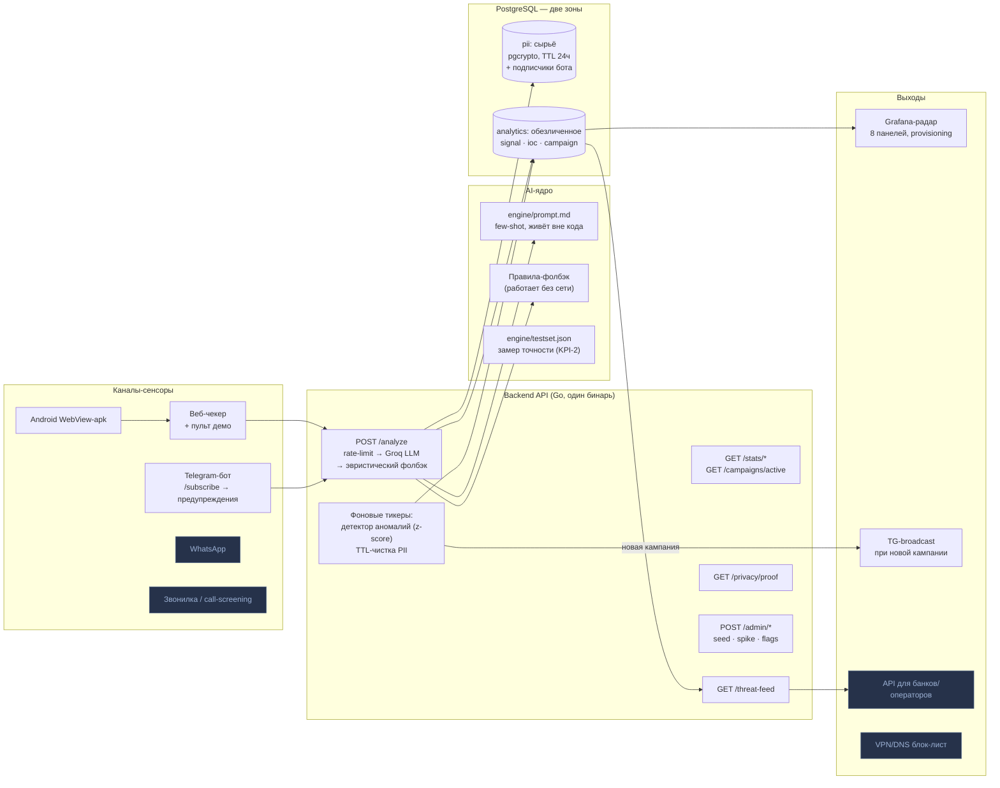
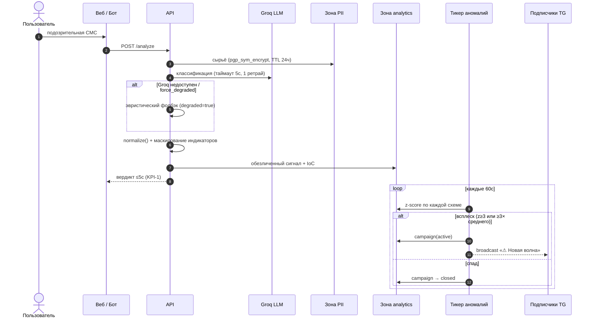
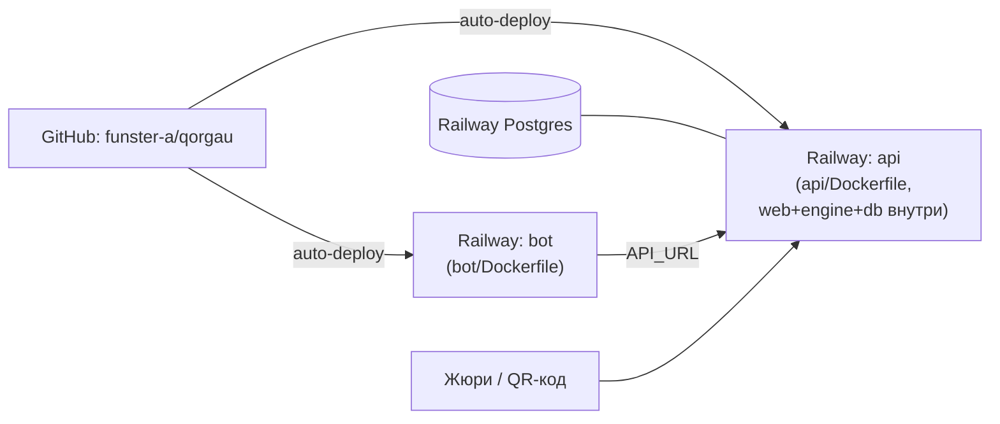

# Архитектура Qorǵau

> Целевая картинка того, что строим на хакатоне. Зелёное — работает,
> жёлтое — в разработке этой ночью, синее — Vision (продаём со сцены как роадмап).

## Общая схема

## Поток одного обращения

## Зоны данных (комплаенс — фишка на защите)

```mermaid
flowchart TB
    RAW["Сырой текст сообщения"] -->|"pgp_sym_encrypt<br/>+ expires_at = now()+24ч"| PII[("pii.raw_submission")]
    RAW -->|"классификация"| FEAT["Только признаки:<br/>схема · риск · флаги · регион"]
    RAW -->|"извлечение + маскирование<br/>+7 7** *** ** 12 · домен целиком"| IOC2["Индикаторы"]
    FEAT --> ANZ[("analytics.signal")]
    IOC2 --> ANIOC[("analytics.ioc")]
    PII -->|"TTL-чистка каждые 10 мин"| DEL["Удалено навсегда"]
    ANZ --> GRAF["Grafana / threat-feed"]
    style PII fill:#3a1f2b,stroke:#7a3b52
    style ANZ fill:#1d3a2f,stroke:#2f7a5b
```

## Разделение работы (люди + агенты)

| Зона | Файлы | Кто |
|------|-------|-----|
| Бэкенд + AI-ядро + бот + БД | `api/`, `bot/`, `engine/`, `db/` | агент-бэк |
| Фронт (чекер + пульт демо) | `web/` | агент-фронт |
| Контракт, интеграция, деплой, доки, git | `docs/`, Dockerfile'ы, коммиты | оркестратор |

Правило: агент не выходит за свои директории. Контракт — `docs/API.md`,
менять его код не может: сначала правка контракта, потом кода.

## Деплой (Railway)

API применяет схему БД сам при старте (bootstrap из `db/schema.sql`),
поэтому на Railway не нужен initdb. Grafana для демо — локально
(docker compose), на сцене показываем localhost или скрин-запись.
